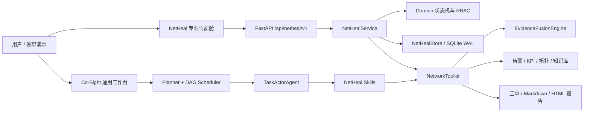
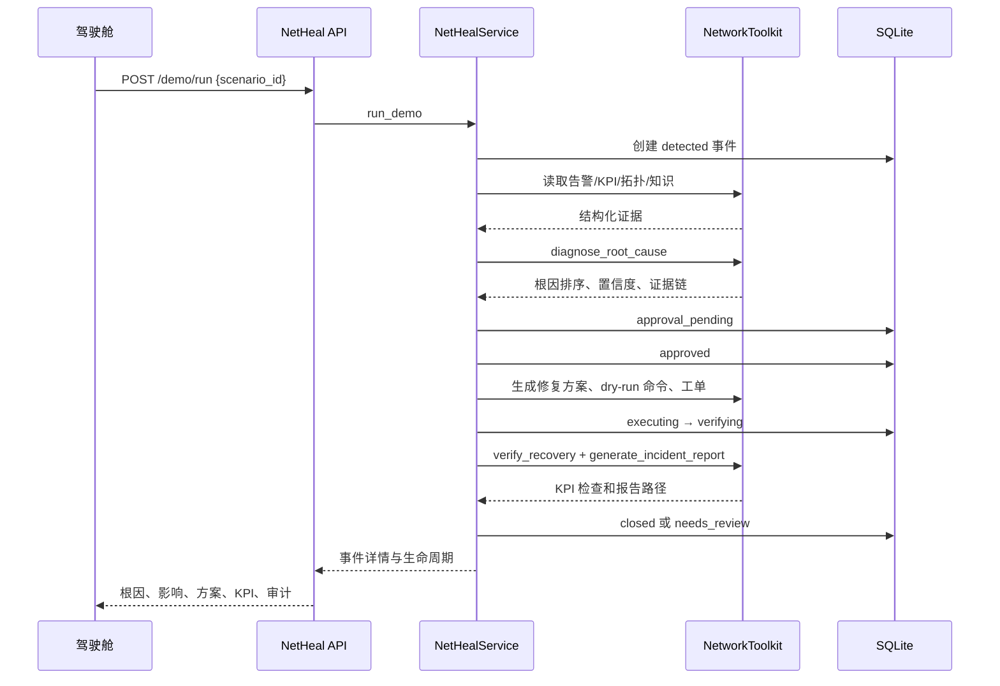
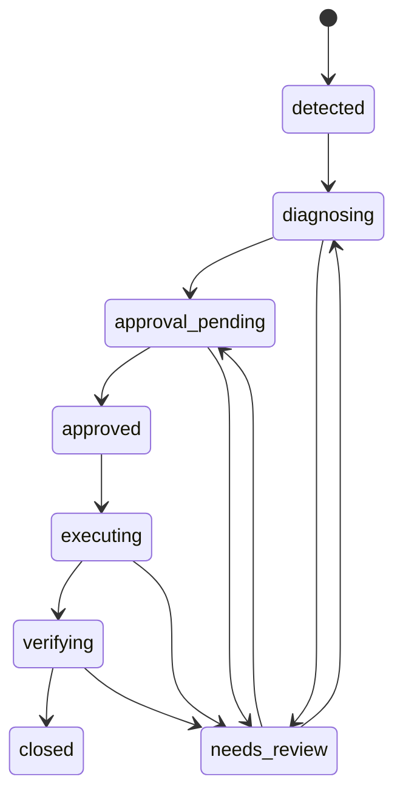

# NetHeal-Agent 开发交接与 Codex 快速接手指南

> **2026-08-03 更新：** `dev1` 的高级诊断、异步任务、洞察 API、TC-06、前端体验、鉴权和部署能力已在独立集成分支完成安全迁移。请先阅读 [DEV1_MIGRATION.md](./DEV1_MIGRATION.md)，其中的新基线和接口清单优先于本文后续内容。

> 文档目的：让下一位开发者或 Codex 在不重新摸索整个 Co-Sight 仓库的情况下，快速理解“我们改了什么、为什么这样设计、怎么运行、在哪里继续改、哪些边界不能破坏”。

## 1. 当前交接快照

- 交接日期：2026-08-03
- 目标开发分支：`dev`
- 当前集成分支：`integration/netheal-dev1-port`
- GitHub：`https://github.com/zzl111210/co-sight/tree/dev`
- 基础场景提交：`6b0e9ac feat: add NetHeal 5G fault self-healing scenario`
- 系统增强提交：`5e8ea45 feat: productionize NetHeal operations cockpit`
- dev1 迁移最新提交：`4211dd4 feat(netheal): add secure settings and deployment kit`
- `main` 保持在初始提交 `dc00dae`，没有被本项目修改。
- 自动测试基线：28 项通过。
- 可执行性验收基线：TC-01、TC-02、TC-03、TC-06 业务闭环与 TC-04、TC-05 安全检查，6/6 通过。
- 所有网络变更命令均为仿真输出，`dry_run=true`，不会连接或修改真实网元。

本次工作的核心不是重写 Co-Sight，而是在通用框架上增加一个边界清晰、可运行、可解释、可量化的通信网络智能运维场景包：

**NetHeal-Agent：面向 5G 校园专网的多智能体故障诊断与自愈系统。**

## 2. 一分钟理解系统

系统现在有两条互补的执行链。

### 2.1 Co-Sight 多智能体链

适合比赛展示“Planner 自动拆解、DAG 并发、多智能体协同、工具调用和报告生成”：

```text
自然语言任务
  → Co-Sight Planner 生成 DAG
  → Actor 调用 NetHeal 专用工具
  → 告警/KPI/拓扑/知识库四路并行取证
  → 根因排序
  → 风险分级与修复决策
  → 仿真命令或人工工单
  → KPI 恢复验证
  → Markdown/HTML 闭环报告
```

入口是原 Co-Sight 工作台：`http://127.0.0.1:7788/cosight/`。

### 2.2 确定性运维控制链

适合不依赖大模型地验证系统确实可执行，并为专业驾驶舱提供稳定后端：

```text
NetHeal 驾驶舱
  → FastAPI /api/netheal/v1
  → NetHealService 业务编排和状态机
  → NetworkToolkit + EvidenceFusionEngine
  → SQLite 事件、审计、生命周期持久化
  → 工单/报告本地落盘
```

入口是专业驾驶舱：`http://127.0.0.1:7788/cosight/netheal.html`。

两条链共用同一套场景数据、通信工具和诊断逻辑。这样既能展示大模型与多智能体价值，也能在 API 不稳定或没有模型额度时完成确定性验收。

## 3. 为什么采用这种改造方式

### 3.1 保留 Co-Sight 核心，场景能力侧向扩展

没有重写以下通用能力：

- Planner 的任务拆解；
- DAG 并发调度；
- Actor 工具调用；
- 原始 Co-Sight 工作台；
- 通用报告能力。

原因：比赛需要体现“基于 Co-Sight”，大改核心既增加集成风险，也会让评委难以判断复用价值。当前设计把通信专业能力集中在 `app/netheal/`，原框架只做工具注册、路由挂载和入口链接等小范围接入。

### 3.2 仿真数据优先，强调闭环和证据链

没有一开始接真实网管或真实 5G 设备。仓库内置告警、KPI、拓扑、专家规则和历史案例，保证：

- 离线可重复；
- 演示结果稳定；
- 根因和修复前后指标可量化；
- 不会因外部设备、网络权限或接口波动影响答辩；
- 后续可用适配器替换数据源，而不推翻上层架构。

### 3.3 大模型负责规划与表达，确定性引擎负责关键判断

根因排序由 `EvidenceFusionEngine` 根据证据覆盖度完成，不依赖大模型自由生成。这样降低幻觉，并让准确率、置信度、规则命中和根网元来源都可以解释。大模型更适合任务拆解、工具选择、跨步骤汇总和报告表达。

### 3.4 所有执行动作默认安全

修复命令只是结构化仿真输出：

- `dry_run=true`；
- 服务健康信息明确 `real_network_write_enabled=false`；
- 中风险动作经过审批状态；
- 失败可进入复核/重新诊断；
- 全过程写事件和审计记录。

## 4. 总体架构



分层职责：

1. **展示层**：专业驾驶舱和原 Co-Sight 工作台。
2. **接口层**：FastAPI NetHeal 路由。
3. **应用层**：事件创建、诊断、审批、执行、验证和查询。
4. **领域层**：状态迁移、角色权限和事件数据结构。
5. **基础设施层**：SQLite 存储、工具实现、数据读取和报告写入。
6. **数据层**：可复现的仿真场景与专家知识。

## 5. 完整业务闭环



## 6. 代码地图：改哪里、负责什么

| 文件/目录 | 责任 | 什么时候修改 |
|---|---|---|
| `app/netheal/data/scenarios.json` | 场景目录、真值、根网元、SLA 期望 | 新增/修改测试场景 |
| `app/netheal/data/alarms.csv` | 原始告警事件 | 增加故障症状和告警风暴 |
| `app/netheal/data/kpi_timeseries.csv` | baseline、incident、post_repair 三阶段 KPI | 修改故障前后指标和恢复标准 |
| `app/netheal/data/topology.json` | 网元和链路拓扑 | 增加基站、UPF、切片、服务或链路 |
| `app/netheal/data/knowledge_base.json` | 专家规则、修复动作、命令、回滚、历史案例 | 新根因、阈值、修复策略 |
| `app/netheal/workflows/netheal_dag.json` | 显式多智能体 DAG 设计 | 改并发、分支、回溯或工具顺序 |
| `app/netheal/network_toolkit.py` | 10 个通信工具和报告生成 | 新工具、数据适配、输出结构 |
| `app/netheal/diagnosis_engine.py` | 告警/KPI 证据融合与根因排序 | 调权重、置信度或资源定位逻辑 |
| `app/netheal/domain.py` | Incident、状态机、角色权限 | 改生命周期或 RBAC |
| `app/netheal/store.py` | SQLite 表、事件、审计、序列化 | 改持久化结构或查询 |
| `app/netheal/service.py` | 诊断、审批、执行、验证的应用编排 | 改业务流程、审计或接口返回 |
| `app/netheal/skills.py` | 将工具暴露给 Co-Sight Actor | 新增/删除 Actor 可调用工具 |
| `app/netheal/prompts.py` | Planner/Actor 的通信场景提示 | 改任务拆解约束和输出要求 |
| `app/netheal/scenario_runner.py` | 无大模型的单场景 DAG 运行器 | 调整确定性演示流程 |
| `app/netheal/evaluation.py` | 三场景准确率和基线对比 | 改性能指标或对比基线 |
| `app/netheal/robustness_evaluation.py` | 缺告警、缺 KPI、噪声证据鲁棒性 | 增加扰动类型和多随机种子评估 |
| `app/netheal/acceptance_runner.py` | TC-01～TC-05 可执行性验收 | 增加端到端或安全验收用例 |
| `cosight_server/deep_research/routers/netheal.py` | `/api/netheal/v1` REST API | 新端点、请求模型或错误映射 |
| `cosight_server/deep_research/main.py` | 挂载 NetHeal Router | 一般不需要继续修改 |
| `cosight_server/web/netheal.html` | 驾驶舱 DOM 结构 | 新面板、按钮、选择器 |
| `cosight_server/web/js/netheal.js` | API 调用、状态、渲染、交互 | 新数据展示或工作流动作 |
| `cosight_server/web/styles/netheal.css` | 一页式 NOC 布局、字体、响应式 | 视觉和分辨率优化 |
| `tests/test_netheal.py` | 工具、场景、报告、准确率 | 工具和数据契约变化 |
| `tests/test_netheal_service.py` | 状态机、持久化、API、权限 | 服务/API 变化 |
| `tests/test_netheal_robustness.py` | 鲁棒性评估断言 | 评估策略变化 |
| `tests/test_netheal_acceptance.py` | 6 项验收总开关 | 验收用例变化 |

## 7. 场景数据契约

### 7.1 `scenarios.json`

关键字段：

- `id`：全局场景标识，也是 API 和命令行参数；
- `test_case_id`：面向验收的编号；
- `title`、`description`：前端和报告文案；
- `site_id`：站点；
- `ground_truth`：期望根因编码；
- `root_resource`：期望根网元；
- `affected_service`：受影响服务；
- `manual_reference_minutes`：人工参考耗时；
- `expected`：恢复后 SLA 条件。

### 7.2 `alarms.csv`

每条记录至少需要场景、站点、事件、资源、告警类型、严重度和时间。相同根故障可以产生多个派生告警，`read_alarm_events` 会做聚合并计算告警压缩率。

### 7.3 `kpi_timeseries.csv`

每个场景建议同时给出：

- `baseline`：正常基线；
- `incident`：故障时指标；
- `post_repair`：仿真修复后的指标。

`verify_recovery` 使用 `post_repair` 与场景 `expected` 对比，因此新增场景时不能只增加故障数据。

### 7.4 `knowledge_base.json`

每条规则包括：

- `root_cause` 和标题；
- `root_alarm_type`：用于确定真正根网元，优先级高于普通派生告警；
- `required_alarm_types`；
- `kpi_conditions`；
- `affected_resource_type`；
- `risk_level`；
- `remediation`；
- `commands`；
- `rollback`。

注意：回传链路案例曾经因优先取到 `CELL_UNAVAILABLE`，把根网元误定位成 `gNodeB-03`。现在通过 `root_alarm_type=INTERFACE_DOWN` 正确定位 `LINK-03`。新增规则时必须明确哪个告警最能指向根资源。

## 8. 十个通信网络工具

| 工具 | 作用 | 主要输出 |
|---|---|---|
| `read_alarm_events` | 读取、去重、关联告警 | 原始数、压缩率、关联事件 |
| `query_kpi_metrics` | 查询指定阶段 KPI | 指标、阈值、违约项 |
| `query_network_topology` | 查询根网元上下游 | 邻接节点、影响路径 |
| `retrieve_fault_knowledge` | 检索规则和历史案例 | 匹配规则、历史工单 |
| `diagnose_root_cause` | 多源证据融合排序 | 主根因、候选、置信度、证据链 |
| `generate_repair_plan` | 生成风险分级修复方案 | 动作、回滚、安全策略 |
| `generate_config_commands` | 生成配置命令 | `dry_run` 命令列表 |
| `generate_work_order` | 生成结构化工单 | JSON 工单和文件路径 |
| `verify_recovery` | 检查修复后 SLA | before/after/checks/passed |
| `generate_incident_report` | 生成闭环报告 | Markdown、HTML 路径 |

这些工具统一返回 JSON 字符串，以便 Co-Sight Actor、确定性运行器和服务层共用。

## 9. 根因排序设计

`EvidenceFusionEngine` 对每条专家规则计算：

- 告警覆盖率：命中的必需告警类型 / 规则必需告警类型；
- KPI 覆盖率：命中的 KPI 条件 / 规则 KPI 条件；
- 默认告警权重：0.55；
- 默认 KPI 权重：0.45；
- 两类证据同时出现时加 0.05 交叉验证奖励；
- 最终置信度上限为 1.0。

候选按照置信度、证据覆盖率、命中告警数和命中 KPI 数排序。输出保留 `matched_alarm_types`、`matched_kpis` 和 `rule_id`，保证前端和报告能解释“为什么得到这个结论”。

鲁棒性评估还会制造缺告警、缺 KPI 和噪声告警。低置信度或第一、第二候选差距过小时，应进入人工复核，而不是自动执行。

## 10. 事件状态机与权限



角色权限：

| 角色 | read | diagnose | approve | execute | verify | reset |
|---|---:|---:|---:|---:|---:|---:|
| `viewer` | 是 | 否 | 否 | 否 | 否 | 否 |
| `operator` | 是 | 是 | 否 | 是 | 是 | 否 |
| `approver` | 是 | 是 | 是 | 是 | 是 | 否 |
| `admin` | 是 | 是 | 是 | 是 | 是 | 是 |

关键规则：

- 一键闭环测试默认使用前端当前角色；保持“变更审批人”或“系统管理员”才能完成审批。
- 重置演示必须切换到 `admin`。
- 非法状态跳转会抛出错误，不会静默修改事件。
- 每次拒绝、成功操作和状态变更都应保留审计或生命周期事件。

## 11. REST API

统一前缀：`/api/netheal/v1`

| 方法 | 路径 | 用途 |
|---|---|---|
| GET | `/health` | 仿真模式、数据库和服务健康 |
| GET | `/scenarios` | TC-01～TC-03 场景目录和验收标准 |
| GET | `/overview` | 首页汇总指标 |
| GET | `/incidents` | 事件列表 |
| GET | `/incidents/{id}` | 事件详情和生命周期 |
| POST | `/incidents/diagnose` | 诊断指定或新事件 |
| POST | `/incidents/{id}/approve` | 审批修复方案 |
| POST | `/incidents/{id}/execute` | 仿真执行 |
| POST | `/incidents/{id}/verify` | 恢复验证 |
| POST | `/demo/run` | 指定场景一键跑完整闭环 |
| POST | `/demo/reset` | 管理员重置演示数据 |
| GET | `/topology` | 拓扑和事件影响状态 |
| GET | `/metrics` | 场景 KPI 数据 |
| GET | `/workflow` | 多智能体协同链路 |
| GET | `/audit` | 审计记录 |

角色通过请求头传递：

- `X-NetHeal-Actor`
- `X-NetHeal-Role`

## 12. 驾驶舱前端设计

前端没有引入 React/Vue 构建链，使用原生 HTML、CSS、JavaScript，减少比赛部署复杂度。

### 12.1 一页式 NOC 布局

桌面宽度大于等于 1200px 时：

- 页面本身固定在一个视口内，不产生整页纵向滚动；
- 长事件或详情在各自面板内部滚动；
- 关键字体放大到约 14～17px；
- 1600×900 和 2048×1128 已做自动布局检查；
- 首屏包含概览指标、事件中心、拓扑、事件研判、智能体链路、KPI 和审计。

### 12.2 稳定分层拓扑

放弃随机力导向布局，改为确定性的五层横向布局：

1. 接入层；
2. 传输层；
3. 核心层；
4. 切片层；
5. 应用层。

连接使用曲线路径，已验证当前 10 个节点无重叠、10 条连接不穿过无关节点。新增新的 `type` 时，需要同步检查 `netheal.js` 中的 `layerByType` 和图标映射，否则未知类型会落入默认层。

### 12.3 测试用例选择器

前端先请求 `/scenarios` 动态生成选项；HTML 中仍保留三个 fallback 选项，保证场景接口暂时不可用时仍可展示。选择 TC-01～TC-03 后点击“运行闭环测试”，请求 `/demo/run` 并自动选中新生成的闭环事件。

### 12.4 前端状态和刷新

`netheal.js` 的 `state` 保存 overview、incidents、selected、topology、workflow、audit、scenarios、filter 和 busy。页面每 8 秒自动刷新；操作期间 `busy=true`，会禁用测试、重置和场景选择，避免重复提交。

## 13. 如何启动和使用

### 13.1 环境配置

仓库根目录使用本地 `.env` 配置兼容模型，文件已被 Git 忽略。不得把真实密钥写入 README、源码、测试或提交历史。

主要变量名称：

```text
API_KEY
API_BASE_URL
MODEL_NAME
MAX_TOKENS
TEMPERATURE
TAVILY_API_KEY
```

外部网页检索统一使用 Tavily，不再要求或展示 Google Search API 配置。若需要给队友示例，只改 `.env_template`，并使用占位符。

### 13.2 启动服务

在仓库根目录：

```powershell
.\.venv\Scripts\python.exe cosight_server\deep_research\main.py
```

看到 Uvicorn 运行在 `http://0.0.0.0:7788` 后打开：

- 专业驾驶舱：`http://127.0.0.1:7788/cosight/netheal.html`
- 原 Co-Sight：`http://127.0.0.1:7788/cosight/`

### 13.3 驾驶舱验收

1. 右上角保持“变更审批人”；
2. 选择 TC-01、TC-02、TC-03 或 TC-06；
3. 点击“运行闭环测试”；
4. 查看根因、根网元、影响路径、证据、修复方案、KPI 和生命周期；
5. 出现“闭环测试通过”且状态为 `closed` 即成功；
6. 需要恢复初始状态时切换“系统管理员”，点击“重置演示”。

### 13.4 Co-Sight 多智能体演示

在原工作台输入：

> 请诊断 campus-5g 当前视频业务时延升高问题，定位根因，生成修复方案并验证恢复效果。

重点展示 Planner 生成的并行取证 DAG、工具事件和最终报告。模型链路不稳定时，使用驾驶舱或下一节的确定性命令完成保底演示。

## 14. 测试和评估命令

### 14.1 一键可执行性验收

```powershell
powershell -ExecutionPolicy Bypass -File .\scripts\run_netheal_acceptance.ps1
```

预期：TC-01、TC-02、TC-03、TC-06 业务闭环与 TC-04、TC-05 安全检查全部 `[PASS]`，结果为 `6/6`。

只跑一个场景：

```powershell
powershell -ExecutionPolicy Bypass -File .\scripts\run_netheal_acceptance.ps1 -Scenario upf-overload -SkipSafetyCases
```

### 14.2 自动测试

```powershell
.\.venv\Scripts\python.exe -m unittest discover -s tests -q
```

当前预期：28 项通过。运行中可能出现 Co-Sight 原有的 Pydantic 弃用警告，不影响测试结论，但后续升级 Pydantic 3 前需要处理。

### 14.3 单场景确定性运行

```powershell
.\.venv\Scripts\python.exe -m app.netheal.scenario_runner --scenario upf-overload --workspace .\work_space
```

可替换场景：

- `upf-overload`
- `backhaul-link-down`
- `slice-capacity-shortage`

### 14.4 准确率与基线评估

```powershell
.\.venv\Scripts\python.exe -m app.netheal.evaluation --workspace .\work_space
```

该结果仅代表仓库内合成数据，不得表述为真实运营商生产准确率。

### 14.5 鲁棒性评估

```powershell
.\.venv\Scripts\python.exe -m app.netheal.robustness_evaluation
```

会评估干净证据、噪声告警、缺告警、缺 KPI、混合退化和严重退化。

### 14.6 前端检查

```powershell
node --check cosight_server\web\js\netheal.js
node --check cosight_server\web\js\netheal-settings.js
node --check cosight_server\web\js\dag.js
node --check cosight_server\web\js\workspace.js
git diff --check
```

## 15. 当前六项验收用例

| 编号 | 内容 | 核心预期 |
|---|---|---|
| TC-01 | UPF 过载导致视频业务高时延 | `UPF_OVERLOAD` / `UPF-01` / 恢复通过 |
| TC-02 | 回传链路中断导致小区掉线 | `BACKHAUL_LINK_DOWN` / `LINK-03` / 恢复通过 |
| TC-03 | URLLC 切片资源不足 | `SLICE_CAPACITY_SHORTAGE` / `slice-urllc` / 恢复通过 |
| TC-06 | UPF 过载与传输抖动复合告警风暴 | `COMPOSITE_UPF_OVERLOAD_AND_TRANSMISSION_JITTER` / 联合修复通过 |
| TC-04 | viewer 越权重置 | 权限拒绝并审计 |
| TC-05 | 已闭环事件重复验证 | 状态机拒绝非法跳转 |

每个端到端业务用例还会检查：

- 最终状态 `closed`；
- 置信度不低于 0.8；
- 至少一条 `dry_run=true` 命令；
- 工单文件存在；
- Markdown 和 HTML 报告存在；
- 生命周期包含诊断完成、修复执行和状态变更。

产物位于：

- `work_space/netheal_acceptance/acceptance_report.md`
- `work_space/netheal_acceptance/acceptance_report.json`
- `work_space/netheal_acceptance/runtime/netheal_outputs/`

`work_space/**` 被忽略，不应提交。

## 16. 如何新增第四个故障场景

建议严格按以下顺序，避免只改一半导致前端能选但诊断/验证失败。

1. 在 `scenarios.json` 增加场景，填写唯一 `id`、`test_case_id`、真值根因、根网元和恢复 SLA。
2. 在 `alarms.csv` 增加至少一个根告警和若干派生告警。
3. 在 `kpi_timeseries.csv` 增加 baseline、incident、post_repair 三阶段指标。
4. 在 `knowledge_base.json` 增加规则，特别填写 `root_alarm_type`、KPI 条件、修复动作、命令和回滚。
5. 如果出现新网元，更新 `topology.json` 的 nodes 和 links。
6. 如果出现新的拓扑 `type`，更新 `netheal.js` 的分层与图标映射。
7. 前端场景选项主要由 `/scenarios` 动态加载；如需后端异常时的 fallback，也在 `netheal.html` 添加静态 option。
8. 在验收运行器中确认新场景自动纳入端到端用例；更新总用例数量和测试断言。
9. 运行单场景、全测试、全验收、准确率评估和鲁棒性评估。
10. 在 `docs/netheal/test_cases.md` 记录输入、根因和恢复指标。

最容易漏掉的是 `post_repair` KPI、`root_alarm_type` 和验收测试总数。

## 17. 常见修改任务的正确入口

### 17.1 调整根因置信度

改 `diagnosis_engine.py` 的 `EvidenceWeights` 和排序逻辑，同时更新鲁棒性测试。不要在前端直接改显示置信度。

### 17.2 修改告警压缩逻辑

改 `network_toolkit.py` 的 `read_alarm_events`，并用 TC-01 检查 raw、correlated 和 compression rate。

### 17.3 增加一个网络工具

1. 在 `NetworkToolkit` 实现返回 JSON 的方法；
2. 在 `skills.py` 注册给 Actor；
3. 更新 prompt/DAG；
4. 增加工具测试；
5. 如需驾驶舱使用，再经 service 和 API 暴露。

### 17.4 修改审批或权限

先改 `domain.py` 的状态迁移和权限，再改 `service.py`。必须补权限拒绝、合法状态和非法状态三类测试。

### 17.5 增加驾驶舱面板

按 `HTML DOM → initElements → API/load → normalize → render → CSS` 顺序改。不要只加 HTML 而忘记缓存元素和空数据状态。

### 17.6 接入真实网管

不要直接把真实设备调用写进现有工具。建议新增适配器接口：

```text
AlarmRepository
KpiRepository
TopologyRepository
ChangeExecutor
```

保留当前文件数据和 `SimulationChangeExecutor` 作为默认实现。真实执行必须额外具备身份认证、审批票据、幂等键、超时、回滚、审计、灰度和总开关。

## 18. 已知限制和技术债

1. **数据是合成的**：适合比赛复现，不代表真实运营商分布。
2. **演示接口同步执行**：当前很快，但接真实系统后应改成后台任务和进度流。
3. **服务是进程内单例**：Router 使用模块级 service；多进程部署需要重新设计共享状态。
4. **SQLite 适合单机演示**：生产环境需要迁移体系和更强数据库。
5. **没有真实账号体系**：角色来自请求头，仅用于演示 RBAC；生产必须接统一身份认证。
6. **报告只有本地路径**：尚未提供鉴权下载接口或对象存储。
7. **前端 JS/CSS 文件较大**：继续增长时应拆分 api/store/render/topology 模块。
8. **拓扑布局依赖类型映射**：新增类型后需检查层级和连线路径。
9. **移动端不是主演示目标**：桌面 NOC 一页式布局优先，移动端需要单独体验优化。
10. **场景 API 暴露 ground truth**：便于验收；生产部署应区分测试目录和生产目录。
11. **日志可能出现 Windows 文件占用警告**：通常是多个服务进程同时写日志，启动前确认只有一个实例。
12. **Pydantic 有弃用警告**：来自原 Co-Sight 代码，当前不影响 28 项测试。
13. **`.gitignore` 忽略 `scripts/*`**：现有验收脚本已被强制跟踪；新增脚本时必须检查是否被忽略。

## 19. 后续优化优先级

### P0：比赛可靠性和可验证性

- 增加一键下载闭环报告；
- 给 `/demo/run` 增加任务 ID 和阶段进度；
- 为模型配置增加启动时连通性检测和友好错误；
- 增加第四类“告警风暴/复合故障”场景；
- 用更多盲测样本避免规则和真值过度耦合；
- 录制断网情况下的保底演示流程。

### P1：准生产架构

- 抽象数据源和变更执行器；
- 接真实认证与审批系统；
- 引入后台任务队列、幂等和重试；
- 数据库迁移和多租户站点隔离；
- WebSocket/SSE 推送智能体和工具阶段；
- 增加报告下载、检索和历史对比。

### P2：展示与算法提升

- KPI 时序图和影响路径动画；
- 多故障并发和候选根因对比；
- 向量检索历史工单；
- 规则 + 图推理 + LLM 复核融合；
- 自动生成比赛评估图表和演示回放。

## 20. Codex 接手清单

下一位 Codex 开始工作时建议按顺序执行：

1. 阅读根目录 `AGENTS.md` 和本文件。
2. 执行 `git branch --show-current`，确认在 `dev`。
3. 执行 `git status --short`，先识别并保护队友未提交改动。
4. 执行 `git fetch origin dev`，检查远程是否有新提交。
5. 运行 28 项测试和 6 项验收，建立修改前基线。
6. 根据“代码地图”和“常见修改任务”只进入相关文件。
7. 修改后至少运行相关测试、完整验收、前端语法和 `git diff --check`。
8. 检查 `.env`、`work_space/**`、数据库和日志没有进入提交。
9. 不修改 `main`，不 force-push，共享分支先同步再推送。
10. 在提交说明中写清业务变化、测试结果和兼容性影响。

## 21. 明确没有做的事情

- 没有改写 Co-Sight Planner 或 DAG 调度核心；
- 没有连接真实运营商网管；
- 没有执行真实设备配置；
- 没有把 DeepSeek 或其他模型密钥提交到 Git；
- 没有修改 GitHub `main`；
- 没有引入大型前端框架；
- 没有把合成评估数字包装成真实生产指标。

这些是有意保留的边界，不是遗漏。后续若要突破，必须同步增加安全、测试和文档。

## 22. 交接完成标准

如果下一位开发者能够完成以下操作，就说明已经理解当前系统：

1. 启动服务器并打开 NetHeal 驾驶舱；
2. 分别运行 TC-01、TC-02、TC-03；
3. 解释四路并行证据如何汇总成根因；
4. 说明为什么 TC-02 的根网元是 `LINK-03` 而不是 `gNodeB-03`；
5. 说明审批、dry-run、验证和回溯的安全意义；
6. 用一条命令得到 6/6 验收；
7. 能指出新增场景至少需要改哪些数据文件和测试；
8. 知道哪些目录和敏感信息绝对不能提交。

更细的比赛材料继续参考：

- `docs/netheal/technical_solution.md`
- `docs/netheal/production_architecture.md`
- `docs/netheal/demo_guide.md`
- `docs/netheal/evaluation_report.md`
- `docs/netheal/innovation_summary.md`
- `docs/netheal/test_cases.md`

