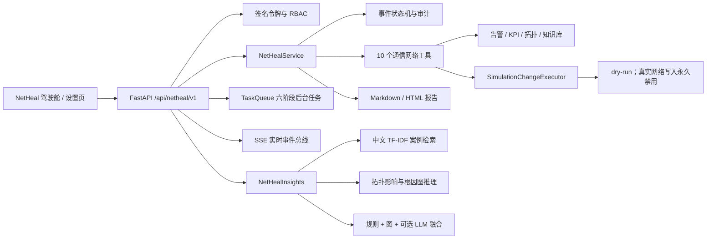

# dev1 功能迁移报告与后续接手指南

更新时间：2026-08-03  
迁移分支：`integration/netheal-dev1-port`  
目标分支：`dev`  
受保护分支：`main`（本次没有检出、合并或修改）

本文记录队友 `dev1` 功能如何迁入 NetHeal-Agent、哪些实现被重构、当前怎么运行，以及后续 Codex 应从哪里继续修改。开始开发前仍需阅读 [CODEX_HANDOFF.md](./CODEX_HANDOFF.md)。

## 1. 迁移策略

没有把 `dev1` 整体直接合并到 `dev`，而是采用“独立集成分支、分批重构、每批验证”的方式：

1. 从最新 `dev` 创建 `integration/netheal-dev1-port`。
2. 按模块检查 `dev1`，只迁移可独立验证的能力。
3. 保留 Co-Sight DAG、工具注册、前端事件模型和 NetHeal 确定性闭环。
4. 对依赖缺失、接口不匹配或安全边界不足的代码重写，不原样复制。
5. 每一批形成独立提交，便于评审、定位问题和回退。
6. 集成分支全部通过后才允许合入 `dev`，`main` 始终不参与。

## 2. 分批提交

| 提交 | 内容 | 关键结果 |
|---|---|---|
| `1ff25a5` | 高级诊断与运行时模块 | 向量案例检索、拓扑图推理、规则融合、生产接口抽象、SSE、任务队列、报告检索 |
| `d06d4fc` | 复合告警风暴场景 | 新增 TC-06，覆盖 UPF 过载与传输抖动叠加故障 |
| `80dc4b8` | 异步任务与洞察 API | 六阶段后台演示、任务进度/结果、SSE、报告下载/搜索/趋势、诊断与评估 API |
| `dfc608c` | 驾驶舱任务体验 | 后台进度、实时事件、报告下载、候选根因、三阶段 KPI 微型趋势图 |
| `74970e5` | 安全鉴权与配置 API | 有时效签名 Bearer Token、开发兼容模式、只读配置、模型连通性检查、站点接口 |
| `4211dd4` | 设置页与部署工具 | 安全设置页、非 root Docker、Compose、一键初始化脚本、部署文档 |

## 3. 当前架构



系统保留两条互补链路：

- Co-Sight 多智能体链负责规划、工具选择、表达和过程演示。
- NetHeal 确定性控制链负责根因真值、权限、状态机、仿真执行和验收。

即使模型暂时不可用，确定性闭环仍能完成比赛演示和自动验收。

## 4. 迁入并重构的能力

### 4.1 高级诊断

新增：

- `app/netheal/advanced_diagnosis.py`
- `app/netheal/interfaces.py`
- `app/netheal/insights.py`

实现要点：

- 中文文本按字符和双字词切分，解决英文式分词无法检索中文案例的问题。
- `VectorCaseRetriever` 对历史案例做轻量 TF-IDF 检索，不增加向量数据库部署负担。
- `GraphReasoner` 根据拓扑邻接关系计算传播路径、受影响节点和根因候选。
- `FusionDiagnosisEngine` 只对实际存在的证据归一化加权；没有 LLM 结果时不会分配虚假权重。
- 数据源和执行器通过 Protocol 解耦。接真实网管时替换适配器，不修改领域状态机。

### 4.2 异步任务与实时事件

新增：

- `app/netheal/task_queue.py`
- `app/netheal/streaming.py`

实现要点：

- `POST /demo/run?async_mode=true` 提交后台闭环任务。
- 任务按告警、KPI/拓扑、知识、根因、处置、验证六阶段上报进度。
- 支持幂等键、结果查询、取消和有限重试。
- SSE 的阻塞队列读取转移到工作线程，避免阻塞 FastAPI 事件循环。
- 驾驶舱轮询任务进度，同时接收 SSE 状态事件。

### 4.3 报告、搜索与解释

新增 `app/netheal/reporting.py`，实现：

- Markdown/HTML 报告元数据和下载；
- 角色校验、工作目录路径约束和访问审计；
- 事故报告全文搜索与 KPI 趋势聚合；
- 诊断证据、推理跳数和候选排序解释；
- 比赛展示需要的准确率、效率和闭环评估数据。

### 4.4 TC-06 复合故障

新增 `alarm-storm-composite`：

- 告警风暴同时包含 UPF 过载、用户面时延、传输抖动与业务体验异常。
- 根因真值为 `COMPOSITE_UPF_OVERLOAD_AND_TRANSMISSION_JITTER`。
- 验证告警压缩、多根因融合、拓扑传播和联合修复。
- 验收总数从 5 增至 6：TC-01、02、03、06 为业务闭环，TC-04、05 为安全验收。

### 4.5 驾驶舱和设置页

驾驶舱保持一页式 NOC 布局，没有增加占据大面积的独立图表面板。增强信息嵌入现有区域：

- 六阶段后台任务进度；
- SSE 在线状态；
- 报告下载；
- 根因候选标签；
- baseline / incident / post-repair 三阶段 KPI 微型趋势图；
- TC-06 静态 fallback。

新增只读设置页：

- `cosight_server/web/settings.html`
- `cosight_server/web/styles/netheal-settings.css`
- `cosight_server/web/js/netheal-settings.js`

设置页不包含密钥输入框，不保存配置，只显示配置状态、非敏感元数据和安全边界，并允许 operator 主动检查模型连接。

### 4.6 鉴权与配置

新增：

- `app/netheal/auth.py`
- `app/netheal/configuration.py`

开发模式：

- 继续兼容 `X-NetHeal-Actor` 和 `X-NetHeal-Role`。
- `/auth/login` 可签发有时效的 itsdangerous 签名令牌。

生产模式：

- 设置 `NETHEAL_AUTH_MODE=production`。
- 必须配置长随机 `NETHEAL_TOKEN_SECRET`。
- 本地登录关闭，写操作必须携带 Bearer 身份。
- 权限仍由领域服务二次校验，不能只依赖前端隐藏按钮。

配置 API 只返回“是否配置”，不返回 `API_KEY`、签名密钥或其他秘密值。

## 5. 关键 API

统一前缀：`/api/netheal/v1`

身份与配置：

- `POST /auth/login`
- `POST /auth/refresh`
- `GET /auth/me`
- `GET /config/status`
- `POST /config/llm/check`
- `GET /sites`
- `GET /health`

事故闭环：

- `GET /scenarios`
- `GET /overview`
- `GET /incidents`
- `GET /incidents/{incident_id}`
- `POST /incidents/diagnose`
- `POST /incidents/{incident_id}/approve`
- `POST /incidents/{incident_id}/execute`
- `POST /incidents/{incident_id}/verify`
- `POST /demo/run?async_mode=true`
- `POST /demo/reset`

任务与实时流：

- `GET /tasks`
- `GET /tasks/{task_id}/progress`
- `GET /tasks/{task_id}/result`
- `POST /tasks/{task_id}/cancel`
- `GET /stream`

报告与洞察：

- `GET /incidents/{incident_id}/report`
- `GET /incidents/{incident_id}/report/download/{md|html}`
- `GET /reports/search`
- `GET /reports/trends`
- `GET /diagnosis/vector-search`
- `GET /diagnosis/graph-reasoning`
- `GET /diagnosis/fusion`
- `GET /diagnosis/explain/{incident_id}`
- `GET /evaluation/charts`
- `GET /audit`

## 6. 没有原样照搬的实现

1. 没有迁移网页直接改写 `.env` 的接口，改成只读状态和显式连接测试。
2. 没有使用未锁定的 JWT 依赖，改为显式锁定 `itsdangerous==2.2.0`。
3. 没有复制修改第三方 site-packages 或忽略安装错误的 Dockerfile。
4. 初始化脚本不会吞掉 pip 或测试失败，也不会覆盖已有 `.env`。
5. SSE 不在 async 路径直接阻塞读取队列。
6. 图表和任务信息压缩进现有卡片，继续满足一页式演示要求。
7. 没有开启真实网管写入，所有命令继续走仿真执行器和 dry-run。
8. 已清除跟踪模板和示例代码中的长 API Key 字符串，真实密钥只保留在被忽略的本地 `.env`。

## 7. 如何运行

Windows 推荐：

```powershell
.\setup-netheal.ps1
```

已有环境直接启动：

```powershell
.\.venv\Scripts\python.exe cosight_server\deep_research\main.py
```

访问：

- `http://localhost:7788/cosight/netheal.html`
- `http://localhost:7788/cosight/settings.html`

演示步骤：

1. 选择 TC-01、TC-02、TC-03 或 TC-06。
2. 保持“变更审批人”角色。
3. 点击“一键自愈演示”。
4. 观察六阶段进度、拓扑影响路径、根因候选和处置建议。
5. 完成后检查状态为 `closed`、验证通过、KPI 恢复，并下载报告。
6. 切换 viewer，验证高风险操作被阻止。

完整部署说明见 [DEPLOYMENT.md](./DEPLOYMENT.md)。

## 8. 验证基线

```powershell
.\.venv\Scripts\python.exe -m unittest discover -s tests -p "test_netheal*.py" -v
.\.venv\Scripts\python.exe -m app.netheal.acceptance_runner
node --check cosight_server/web/js/netheal.js
node --check cosight_server/web/js/netheal-settings.js
node --check cosight_server/web/js/dag.js
node --check cosight_server/web/js/workspace.js
git diff --check
```

当前结果：

- 28/28 自动测试通过；
- 6/6 验收用例通过；
- 四个前端脚本语法检查通过；
- 大屏、设置页、脚本和配置 API 的进程内 HTTP 检查均为 200；
- PowerShell 脚本、HTML 和 Compose YAML 静态解析通过；
- 当前开发机未安装 Docker，镜像尚未在本机实跑。

## 9. 后续修改入口

| 需求 | 首选修改点 |
|---|---|
| 新增故障场景 | `app/netheal/data/*`、知识库、验收真值、前端 fallback |
| 调整根因算法 | `diagnosis_engine.py`、`advanced_diagnosis.py`、鲁棒性测试 |
| 接真实数据源 | 实现 `interfaces.py` 中的 Repository Protocol |
| 接真实执行器 | 新建 ChangeExecutor，并单独评审审批、回滚、凭据和沙箱 |
| 改任务阶段 | `service.py`、`task_queue.py`、前端进度渲染 |
| 改 SSE | `streaming.py` 与 `/stream` |
| 改权限 | `auth.py`、`domain.py`、`service.py`，同时补允许和拒绝测试 |
| 改报告 | `reporting.py`、服务报告生成、下载路径约束测试 |
| 改设置页 | HTML → JavaScript → CSS |
| 改部署 | `Dockerfile`、`docker-compose.yml`、`DEPLOYMENT.md` |

## 10. 合入 dev 的建议流程

先确认远程 `dev` 没有新提交：

```powershell
git fetch origin
git log --oneline --left-right dev...origin/dev
git status --short
```

再次运行第 8 节验证。全部通过后：

```powershell
git switch dev
git pull --ff-only origin dev
git merge --no-ff integration/netheal-dev1-port
git push origin dev
```

不要向 `main` 合并或推送。若远程 `dev` 已前进，应从最新 `dev` 新建临时集成分支重新验证，避免强推或重置。
