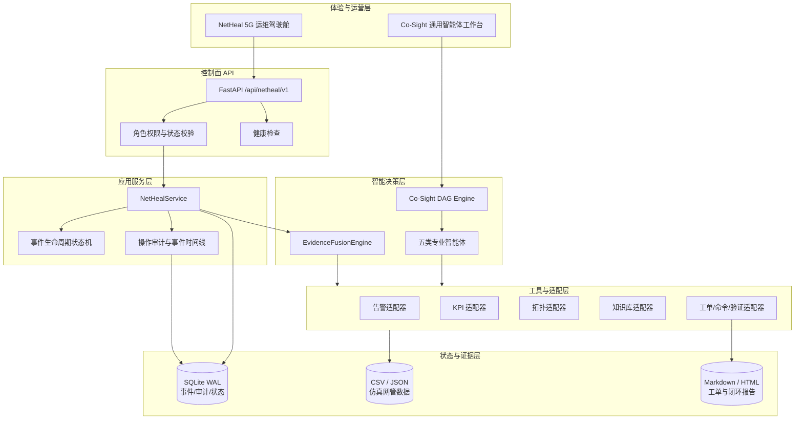
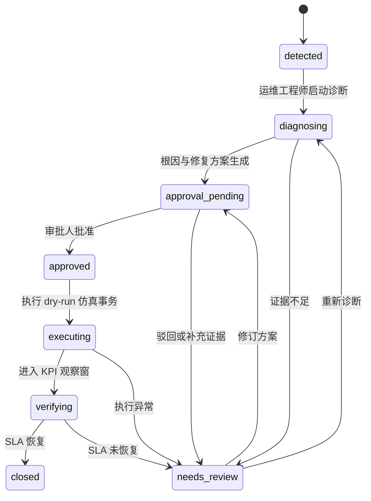

# NetHeal-Agent 可运营架构说明

## 1. 目标

NetHeal-Agent 不把比赛案例实现成一次性脚本，而是把故障处置建模为可持久化、可审批、可审计、可回溯的智能事件。系统在保留 Co-Sight 通用 Planner、DAG 调度器和 Actor 工具机制的同时，新增独立的通信网络运维控制面和专业驾驶舱。

当前版本默认运行在本地仿真模式，不连接或修改真实网元。生产接入时需要替换数据适配器、接入统一身份认证并完成网元变更安全评审。

## 2. 分层架构



## 3. 智能事件生命周期



非法状态跳转会在服务层被拒绝。例如，未诊断事件不能直接执行修复，未审批方案不能进入执行状态。

## 4. 角色与权限

| 角色 | 查看 | 诊断 | 审批 | 仿真执行 | 验证 | 重置演示 |
|---|---:|---:|---:|---:|---:|---:|
| `viewer` | ✓ |  |  |  |  |  |
| `operator` | ✓ | ✓ |  | ✓ | ✓ |  |
| `approver` | ✓ | ✓ | ✓ | ✓ | ✓ |  |
| `admin` | ✓ | ✓ | ✓ | ✓ | ✓ | ✓ |

驾驶舱通过 `X-NetHeal-Actor` 和 `X-NetHeal-Role` 展示 RBAC 流程，越权请求返回 403 并写入审计表。它是比赛仿真的身份适配层，不等价于生产认证；正式部署应由 API Gateway 校验 OIDC/JWT，并把可信身份注入服务。

## 5. REST API

统一前缀：`/api/netheal/v1`

| 方法 | 路径 | 作用 |
|---|---|---|
| GET | `/health` | 数据文件、SQLite 和仿真安全状态 |
| GET | `/overview` | 网络健康度与事件统计 |
| GET | `/incidents` | 智能事件队列 |
| GET | `/incidents/{id}` | 事件、证据、修复和时间线 |
| POST | `/incidents/diagnose` | 四路取证与融合诊断 |
| POST | `/incidents/{id}/approve` | 人工审批修复方案 |
| POST | `/incidents/{id}/execute` | dry-run 修复事务、命令和工单 |
| POST | `/incidents/{id}/verify` | SLA 恢复验证与闭环/回溯 |
| GET | `/topology` | 事件增强网络拓扑 |
| GET | `/metrics` | KPI 时序数据 |
| GET | `/workflow` | 多智能体 DAG 定义 |
| GET | `/audit` | 操作审计记录 |
| POST | `/demo/run` | 一键执行完整仿真闭环 |
| POST | `/demo/reset` | 管理员重置演示环境 |

## 6. 持久化模型

SQLite 使用 WAL 模式并包含三类表：

- `incidents`：当前事件快照、根因、置信度、证据、修复事务和乐观版本号。
- `incident_events`：仅追加的生命周期时间线。
- `audit_records`：操作者、角色、动作、结果和结构化详情。

数据库连接按请求关闭，避免 Windows 文件句柄泄漏。仓库不会提交运行时数据库和生成报告。

## 7. 证据融合与不确定性

`EvidenceFusionEngine` 将告警覆盖率和 KPI 条件覆盖率加权融合，并保留：

- 命中的告警类型；
- 命中的 KPI 条件及样本；
- 每种证据覆盖率；
- 根因候选置信度；
- 第一、第二候选差值；
- 根网元推断来源。

鲁棒性评测在证据缺失或告警噪声下使用“低置信度/小候选差值转人工复核”，避免证据不足时强行自动修复。

## 8. 安全护栏

- `real_network_write_enabled=false`，所有自动执行均为本地仿真。
- 配置命令固定 `dry_run=true`。
- 审批前已生成修复方案、风险等级和回滚策略，审批人不会盲批。
- 状态机阻断乱序操作。
- 越权尝试写入审计。
- 报告、工单、命令和验证结果均关联事件 ID。
- 健康接口不暴露本地数据库绝对路径。

## 9. 可替换适配器

比赛版使用仓库内 CSV/JSON 保证离线复现。生产化时保持工具 schema 不变，替换以下数据源：

| 当前适配器 | 生产候选 |
|---|---|
| `alarms.csv` | 综合网管、Kafka 告警总线、Webhook |
| `kpi_timeseries.csv` | Prometheus、时序数据库、性能管理系统 |
| `topology.json` | CMDB、IP/传输拓扑、数字孪生 |
| `knowledge_base.json` | 向量知识库、历史工单、专家规则平台 |
| 仿真命令与 JSON 工单 | 厂商 EMS/NMS、ITSM、变更编排平台 |

## 10. 驾驶舱信息架构

`/cosight/netheal.html` 提供：

- 网络健康度、活动事件、关键事件、AI 置信度、告警压缩率和闭环率；
- 可筛选事件队列；
- 事件增强拓扑与根因路径高亮；
- 五类智能体 DAG 进度；
- 根因、影响面、多源证据和风险分级方案；
- 基于角色和状态的操作按钮；
- 修复前后 KPI 对比；
- 生命周期时间线与全局审计日志；
- 8 秒自动刷新、一键闭环和管理员重置。

原 Co-Sight 页面保留，并新增 NetHeal 入口。比赛既能展示通用 Planner 的实时工具过程，也能展示面向运维人员的行业化控制台。

## 11. 验证与运行

```powershell
python -m unittest discover -s tests -v
python -m app.netheal.evaluation --workspace .\work_space
python -m app.netheal.robustness_evaluation
python cosight_server/deep_research/main.py
```

访问：

- Co-Sight 通用工作台：`http://localhost:7788/cosight/`
- NetHeal 运维驾驶舱：`http://localhost:7788/cosight/netheal.html`
- NetHeal 健康检查：`http://localhost:7788/api/netheal/v1/health`

## 12. 生产上线前检查项

- 接入可信身份认证和 API Gateway，禁止客户端自报角色。
- SQLite 替换为高可用 PostgreSQL，并增加数据库迁移工具。
- 接入真实网管前完成命令白名单、双人审批、变更窗和紧急熔断。
- 引入消息队列和异步任务，避免长时间诊断阻塞 HTTP 请求。
- 为接口增加限流、指标、链路追踪、告警和集中日志。
- 使用脱敏后的历史故障集完成离线盲测、灰度验证和误修复评审。
- 对多故障并发、未知故障、数据延迟和恢复失败进行压力与混沌测试。
