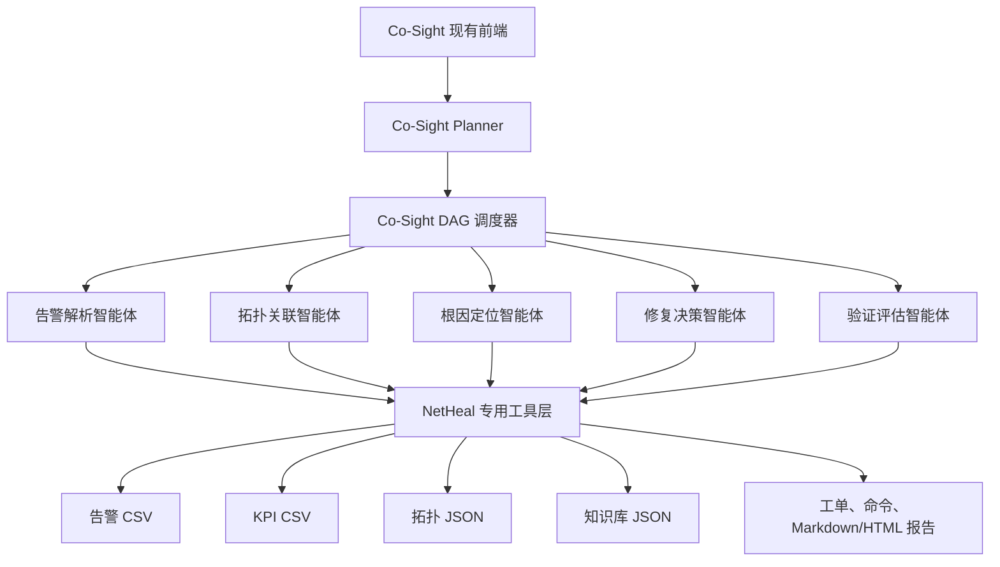
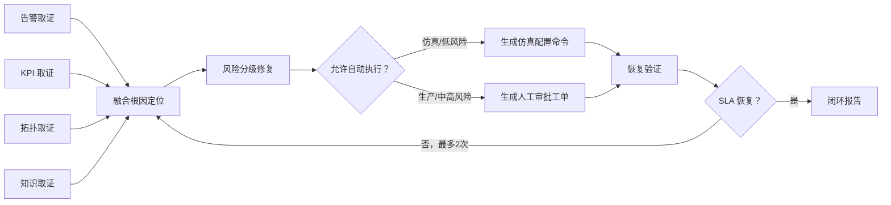

# NetHeal-Agent 技术方案

## 1. 项目定位

NetHeal-Agent 面向 5G 校园/企业专网运维场景，基于 Co-Sight 构建多智能体协同的网络故障诊断与自愈系统，实现告警解析、KPI 分析、拓扑关联、根因定位、修复决策、恢复验证和报告生成的闭环自动化。

第一阶段聚焦“UPF-01 过载导致视频业务高时延”，以可运行、可解释、可量化的小场景验证方案。回传链路中断和切片资源不足作为扩展测试场景。

## 2. 改造原则

- 保留 Co-Sight planner、Actor、DAG 调度、工具事件和现有前端。
- 新增独立的 `app/netheal` 场景包，避免把行业逻辑散落到通用框架。
- 对既有代码只增加工具注册、函数映射和场景提示，不重写调度器。
- 仿真数据、规则和评测全部纳入仓库，保证离线可复现。
- 真实网络配置默认禁止自动执行；比赛自动闭环仅作用于本地仿真。

## 3. 系统架构



## 4. 智能体分工

| 角色 | 主要职责 | 核心工具 | 输出 |
|---|---|---|---|
| 告警解析智能体 | 告警清洗、去重、关联压缩 | `read_alarm_events` | 结构化告警和关联组 |
| 拓扑关联智能体 | 识别根网元邻接与故障传播范围 | `query_network_topology` | 影响网元和下游业务 |
| 根因定位智能体 | 融合告警、KPI、规则和历史案例 | `query_kpi_metrics`、`retrieve_fault_knowledge`、`diagnose_root_cause` | 候选根因排序与证据链 |
| 修复决策智能体 | 风险分级、修复动作、配置命令和工单 | `generate_repair_plan`、`generate_config_commands`、`generate_work_order` | 可审计修复方案 |
| 验证评估智能体 | 检查 SLA、决定闭环或回溯、生成报告 | `verify_recovery`、`generate_incident_report` | 恢复结论和闭环报告 |

五类角色通过 Co-Sight planner 生成的步骤标签显式呈现。Co-Sight 会为可执行步骤创建独立 Actor 实例，并按依赖并发调度。

## 5. DAG 编排

工作流定义位于 `app/netheal/workflows/netheal_dag.json`。



Co-Sight 实际计划使用 8 个步骤：

1. 告警解析。
2. KPI 查询。
3. 拓扑查询。
4. 知识检索。
5. 四路证据融合根因定位。
6. 风险分支修复、命令和工单。
7. 恢复验证与失败回溯。
8. 生成闭环报告。

步骤 1-4 无依赖，可并发执行；步骤 5 依赖前四步，后续按闭环顺序执行。链路深度超过 3 跳。

## 6. 主案例证据链

主案例输入：

> 请诊断 campus-5g 当前视频业务时延升高问题，定位根因，生成修复方案并验证恢复效果。

关键证据：

- UPF-01 CPU：94%，阈值 85%。
- 视频切片时延：85 ms，SLA 30 ms。
- 视频切片丢包率：3.5%，SLA 0.5%。
- UPF-01 吞吐量：930 Mbps，容量告警阈值 850 Mbps。
- 拓扑显示 UPF-01 承载 `slice-video`，UPF-02 为备用节点。
- 专家规则 `KB-UPF-001` 与历史案例 `CASE-2026-017` 匹配。

诊断结果为 `UPF_OVERLOAD`。仿真修复包括迁移 40% 视频流量至 UPF-02、提高视频切片带宽和降低非关键 eMBB 优先级。

恢复验证：

| 指标 | 故障期 | 修复后 | SLA | 结果 |
|---|---:|---:|---:|---|
| 时延 | 85 ms | 22 ms | ≤30 ms | 通过 |
| 丢包率 | 3.5% | 0.4% | ≤0.5% | 通过 |

## 7. 工具/API 分类

赛题要求至少三类工具/API，本方案覆盖五类：

- 网管告警接口：模拟告警读取与关联。
- 性能监控接口：KPI 查询与阈值检测。
- 网络资源接口：拓扑与影响范围查询。
- 知识检索接口：专家规则与历史工单匹配。
- 运维执行接口：修复策略、配置命令、工单、验证和报告。

当前实现使用仓库内 CSV/JSON 作为稳定的 API 适配器数据源。后续接真实系统时只需替换工具内部数据访问层，工具 schema 和 DAG 不变。

## 8. 可信安全设计

- 每次诊断返回告警事件 ID、KPI 样本、知识规则 ID 和推理跳点。
- 根因候选按证据匹配率排序，不仅依赖大模型自然语言判断。
- 配置命令为厂商中立的比赛仿真格式，默认 `dry_run=true`。
- 真实配置变更必须人工审批，修复计划包含回滚命令。
- 工单记录事件、根因、影响范围、修复动作和审批状态。
- 评测文档明确区分仿真指标和真实生产指标。

## 9. 代码结构

```text
app/netheal/
├── data/                 # 告警、KPI、拓扑、知识库和场景真值
├── workflows/            # 含并发、条件和回溯的 DAG 定义
├── diagnosis_engine.py   # 可解释的多源证据加权融合
├── domain.py             # 智能事件状态机与角色权限
├── store.py              # SQLite 事件、时间线和审计持久化
├── service.py            # 诊断、审批、执行、验证应用服务
├── network_toolkit.py    # 10 个通信运维工具
├── skills.py             # Co-Sight SkillFunction 声明
├── prompts.py            # 场景识别、规划和 Actor 约束
├── scenario_runner.py    # 不依赖大模型的一键闭环演示
├── evaluation.py         # 三场景功能基线评测
└── robustness_evaluation.py # 360 样本鲁棒性评测
```

## 10. 当前边界与后续工作

- 当前数据为小规模合成数据，适合功能验证，不代表真实运营商网络分布。
- 本地确定性工具链已验证；完整 Co-Sight LLM 前端演示还需要配置 `.env` 模型接口。
- 赛题写明需使用 Co-Sight 2.0 及以上，但当前仓库 `setup.py` 标注为 1.0，官方公开仓库目前仅能检索到 `v0.0.1` 标签。参赛前必须向主办方确认“2.0”的具体判定口径，或取得指定版本代码。
- 后续应扩充带噪声、多根因、缺失 KPI 和修复失败样本，并在同一冻结测试集上复测。

> 当前增强版已完成专业运维驾驶舱、REST API、RBAC 演示、SQLite 状态持久化、审计和 360 样本告警噪声/证据缺失评测。比赛身份头不替代生产 OIDC/JWT；自动执行严格限制在 `dry_run` 仿真模式。后续验证重点转为多根因并发、未知故障、修复失败和真实脱敏数据盲测。

更完整的部署边界、安全护栏和生产替换清单见
[可运营架构说明](production_architecture.md)。
